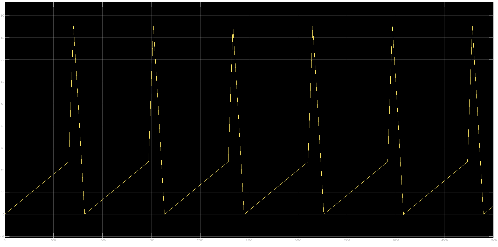
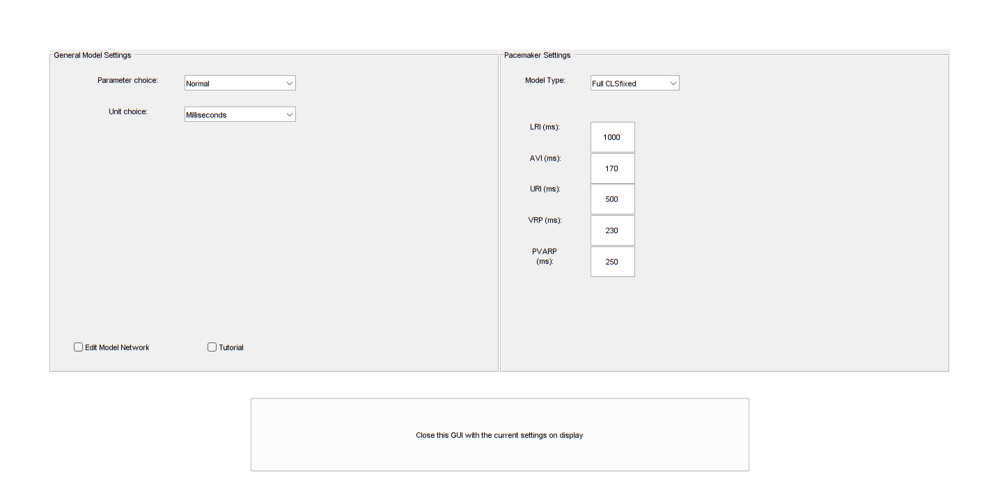
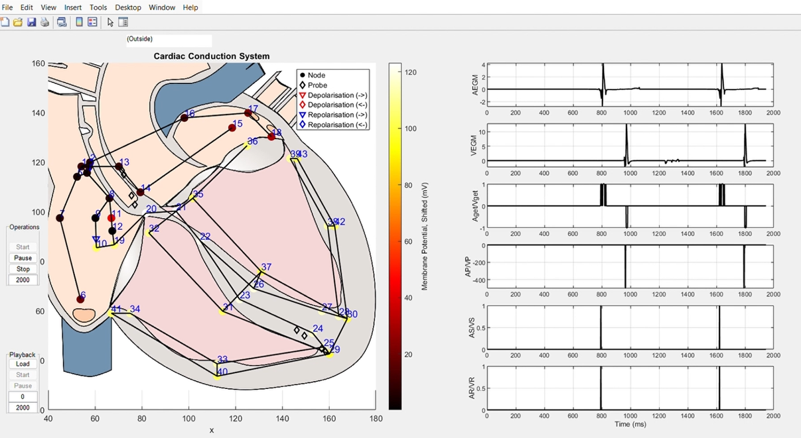
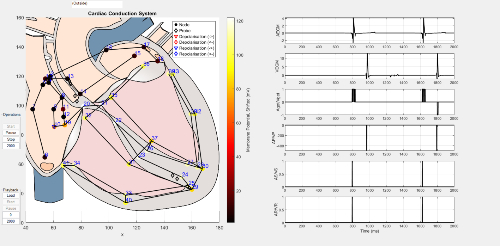
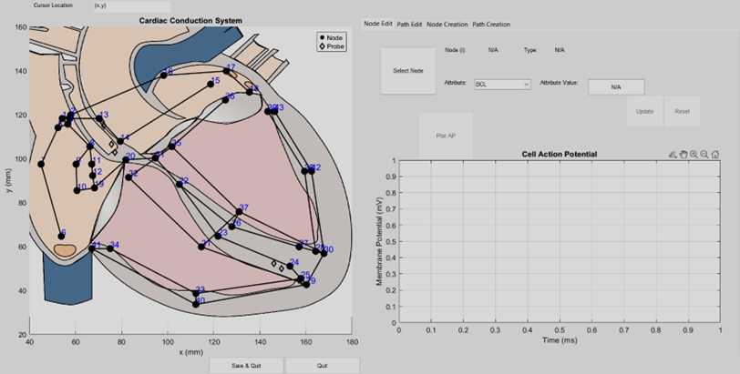
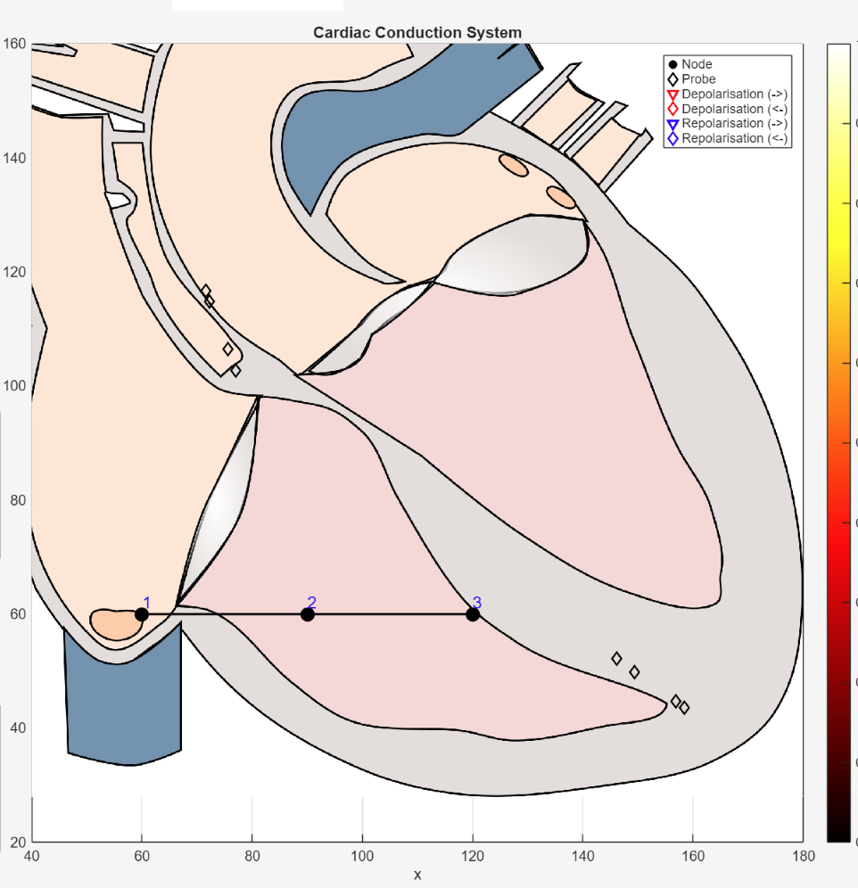
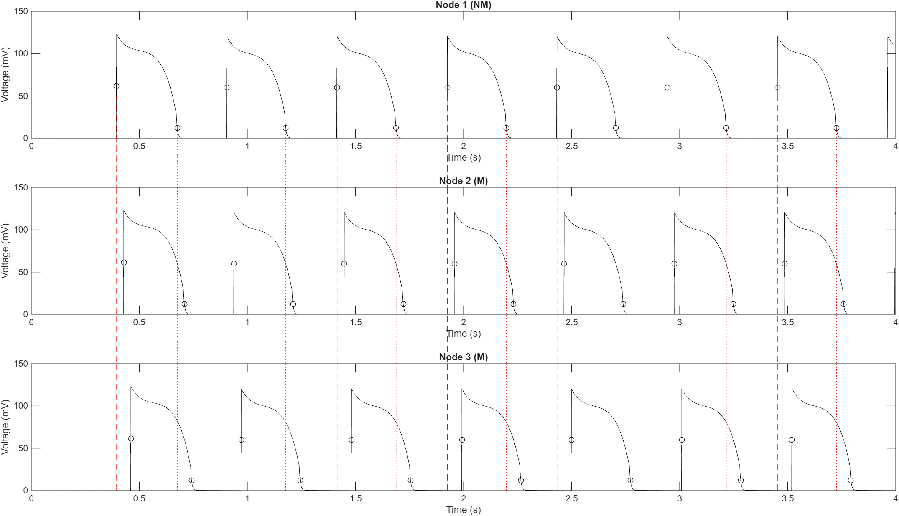
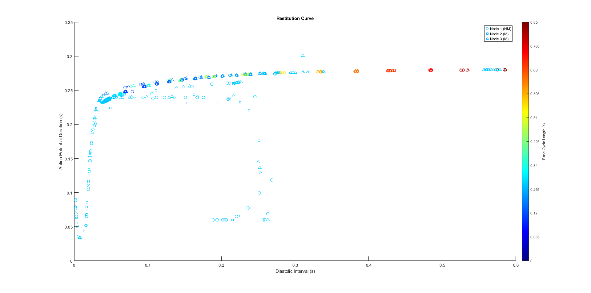
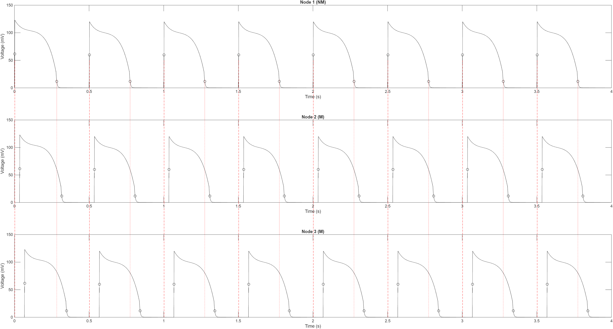
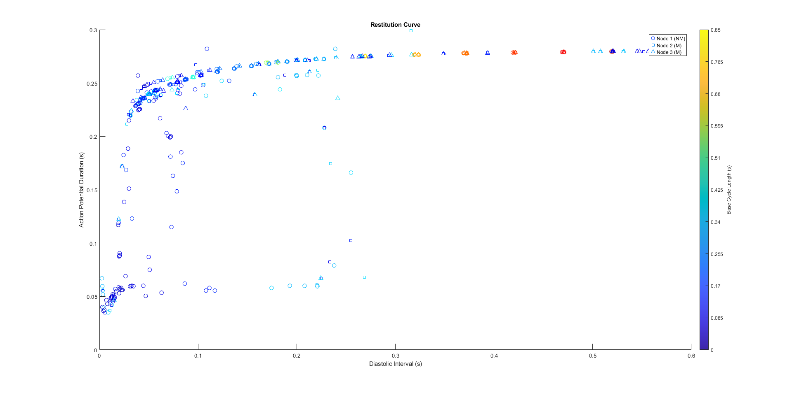

<h1>
<span style="color:#e63946">P</span>aced
<span style="color:#e63946">A</span>utomata model for
<span style="color:#e63946">C</span>ardiac
<span style="color:#e63946">E</span>lectrophysiology in
<span style="color:#e63946">R</span>eal-time
</h1>

<p align="center">
  
</p> 

PACER/ HeartModelPub provides a computational heart model for simulating cardiac electrophysiology and testing implantable pacemaker devices in closed-loop scenarios.

HeartModelPub includes:

- Pacemaker cell models [[1]](https://doi.org/10.1109/tbme.2017.2695537)  
- Cardiomyocytes [[2]](https://doi.org/10.1145/3134845) ,[[3]](https://doi.org/10.1109/tbme.2019.2917212) 
- Cardiac conduction system [[3]](https://doi.org/10.1109/tbme.2019.2917212)
- Electrogram (EGM) signal generation [[4]](https://doi.org/10.1109/embc.2017.8037237)

All models are implemented in MATLAB/Simulink, allowing modular configuration, parameter tuning, and closed-loop simulations.

We have demonstrated in-silico validation of a DDD mode pacemaker using the virtual physiological heart model in the closed loop [[5]](https://doi.org/10.1109/jbhi.2019.2947007)
For C code generation and implementation using Piha, refer to [[6]](https://dl.acm.org/doi/10.5555/2971808.2971959),[[7]](https://dl.acm.org/doi/abs/10.1145/3126536).

Last updated: January 12, 2026.

>© Copyright 2025 Weiwei Ai, wai484@aucklanduni.ac.nz, The University of Auckland 

>   Licensed under the Apache License, Version 2.0 (the "License" ); you may not use this file except in compliance with the License. You may obtain a copy of the License at http://www.apache.org/licenses/LICENSE-2.0
>
>   Unless required by applicable law or agreed to in writing, software distributed under the License is distributed on an "AS IS" BASIS, WITHOUT WARRANTIES OR CONDITIONS OF ANY KIND, either express or implied.
>   See the License for the specific language governing permissions and limitations under the License.

</br>

<p align="center">
  <a href="http://www.apache.org/licenses/LICENSE-2.0">
    
  </a>
  <a href="https://au.mathworks.com/matlabcentral/fileexchange/154301-heartmodelpub/">
    
  </a>
  <a href="https://github.com/PRETgroup/HeartModelPub">
    
  </a>
</p>

---

## Table of Contents

1. [Introduction](#introduction)
   - [Background](#background)
   - [Model Descriptions](#model-descriptions)
       - [Model Libraries](#model-libraries)
       - [Scripts](#scripts)
       - [Parameter files ](#parameter-files)
   
2. [Cell Models](#cell-models)
   - [Cell Types Overview](#cell-types-overview)
   - [Pacemaker Cells (Type N)](#pacemaker-cells-type-n)
   - [Myocytes (Type M)](#myocytes-type-m)
   - [Subsidiary Pacemakers (Type NM)](#subsidiary-pacemakers-type-nm)

3. [Path Model](#path-model)
 
4. [Closed Loop System](#closed-loop-system)
    - [Pacemaker Model](#pacemaker-model)
   
5. [Getting Started](#getting-started)
   - [Setup Instructions](#add-the-library-files-to-the-path) 
   - [Run model simulations](#run-model-simulations)

6. [Examples](#examples)
   - [Example 1:](#example-1)
   - [Example 2:](#example-2)
   - [Example 3:](#example-3)
   - [Example 4:](#example-4)
   - [Example 5:](#example-5)

7. [Need-to-Know](#need-to-know)

8. [References](#references)

9. [Acknowledgment](#acknowledgment)

10. [License History](#license-history)
---

## Introduction

The core objective of this work is the development of a flexible, efficient, and verifiable computational model for real-time virtual hearts. This virtual heart is intended for the closed-loop validation of cardiac devices. The proposed framework supports device testing within an in-silico closed-loop context of patient physiology.

### Background

Traditional biophysically-based heart models rely on coupled differential equations, making them computationally costly to solve and unsuitable for real-time emulation or formal verification. 
To overcome this challenge while retaining dynamic physiological features, the models utilize the Hybrid Automaton (HA) formalism. 
HA models retain computational efficiency while supporting the modeling of continuous membrane voltage evolution and distinct action potential phases.

The heart is represented as an abstracted network of nodes (regional tissue clusters) connected by edges.

<p align="center">
  
</p> 

### Model Descriptions

The heart model is organized into libraries, models, and scripts. Each component is designed for specific role.  
- The [Lib ](./Lib/) folder contains the core component libraries, including cell models (pacemaker, myocyte, and subsidiary pacemaker cells), conduction paths, EGM sensing modules, and pacemaker devices, with separate versions for millisecond- and second-based simulations. 
- The [models ](./models/) provides pre-built examples, ranging from single-cell pacemaker models to full heart simulations, allowing users to quickly run simulations or test specific scenarios. 
- For more detailed or high-resolution variants, the [models_refine ](./models_refine/) contains complex heart models with increased numbers of nodes and paths. 
- The [src ](./src/) hosts all utility scripts, including automatic model builders, configuration processors, GUI tools, plotting functions, and parameter generators, enabling users to customize and automate simulations. 

#### Model Libraries

Two versions of library exist:  [Libs.slx](./Lib/Libs.slx) & [Libs_second.slx](./Lib/Libs_second.slx)
<br> Same components but adapted for second based simulation for hardware integration ([Notes on Modification from Milliseconds (ms) to Seconds](#notes-on-modification-from-milliseconds-ms-to-seconds)).

#### Model Libraries

| Model | Description |
|-------|-------------|
| **Node_N_V6.slx** | - Nodal pacemaker cell model<br>- Updates parameters at the beginning of slow depolarization  <br>- Computes t3 and t0 before updating<br>- Computes d2 and d1 after updating |
| **Node_M_V4.slx** | - Cardiac myocyte cell model<br>- Parameters updated only at the start of a new cycle (before entering q1)<br>- Interfaces with path model |
| **Node_NM_V4.slx** | - Subsidiary pacemaker cell<br>- Hybrid nodal–muscle cell enabling both pacemaker and fast-response behaviours |
| **Path_V3.slx** | - Electrical conduction path model<br>- Simulates the propagation of action potentials between cardiac cells |
| **Electrode.slx** | - Computes the potential sensed by pacemaker leads due to moving activation along a path |
| **Sensing.slx** | - EGM signal combination and control module |
| **Pre_eventsv1.slx** | - Preprocesses and conditions input signals |
| **Ratesv1.slx** | - Computes atrial/ventricular instantaneous rates<br>- Provides rate-dependent variables |
| **Cnds_DDDv1.slx** | - Monitors execution traces<br>- Checks compliance with pacemaker specifications |
| **PMTv1.slx** | - Pacemaker-mediated tachycardia detector<br>- Identifies PMT loops<br>- Monitors retrograde conduction and atrial tracking |
| **PM_DDD_v3.slx** | - Dual-chamber pacemaker model (DDD mode) |
| **HeartV9.slx** | - Full heart model integrating nodes, myocytes, and conduction paths |

#### Scripts

| Script | Description |
|--------|-------------|
| **PreBuild.m** | - Demo showing automatic building of a heart model |
| **PreCfgfcn.m** | - Reads parameters from an Excel file using filenames and data range<br>- Generates configuration data for heart model building<br>- Creates a lookup table for parameter updates<br>- **Cfgports**: Input configuration for the demux connecting to the parameter input port<br>- **Cfgdata**: All the parameters |
| **Buildmodel_fcn.m** | - Automatically builds a heart model using available parameters and connection relations of cells and paths (node names, types, path names)<br>- Requires specifying the component library |
| **Heart_GUI.m** | - Generates a UI and links it to the model |
| **SaveTrace_sfcn.m** | - Updates the UI and saves simulation traces |
| **subtightplot.m** | - Makes the subplots close to each other<br>- Utility script obtained online |
| **genpp.m** | - Generates new parameters |

#### Parameter files  

| File | Description |
|------|-------------|
| **Heart_N3.xlsx** | Contains the parameters of the heart model with simulation time in **milliseconds** |
| **Heart_N3_second.xlsx** | Contains the parameters of the heart model with simulation time in **seconds** |

#### Notes on Modification from Milliseconds (ms) to Seconds 

The model was originally developed using **milliseconds (ms)** as the simulation time.  
For hardware integration, it has been modified to use **seconds (s)**. The key modifications are:

- **Node_N_V6 / Automaton / function rr=RR(...) / line 27:**   `y =bff'*2*pi*pt`: removed `/1000` in **Libs_second.slx**.
- **Sensing / Chart and Sensing / Chart3:**  
  Use `temporalCount(msec)` and `after(3,msec)` in **Libs_second.slx**.  
  In **Libs.slx**, the original code uses `temporalCount(sec)` and `after(3,sec)`.
- **Libs_second / Path_V3 / Path (Buffer_i and Buffer_j):**  
  Thresholds changed: `tbi >= 599` → `tbi >= 0.599`, `tbj >= 599` → `tbj >= 0.599`.  
  Note: This only affects action potentials where APD > 600 ms.
- **CLK Modules (inputs to Sensing, Pre_eventsv1, Ratesv1, Cnds_DDDv1, PMTv1, PM_DDD_v3):**  
  Set `Period(secs) = 0.001`.
- **Timing parameters of sensing and pacemaker modules:**  
  Remain the same (use ms).
- Use **Heart_N3_second.xlsx**, which contains modified parameters for simulation time in seconds.

## Cell Models

Cell model is developed as a computational HA pacemaker cell model with the ability to efficiently describe dynamic electrical behaviors and adaptation to pacing frequency, and compares.
The HA model can be parameterized to capture the features of different cardiac pacemaker cells.

### Cell Types Overview

The cardiac conduction system is represented using three main cell types:
  1. Pacemaker Cells (Type N)
      Cells with intrinsic automaticity that spontaneously initiate action potentials.
  2. Myocytes (Type M)
      Contractile myocardial cells that propagate electrical signals but do not normally self-excite.
  3. Subsidiary Pacemakers (Type NM)
      Cells that combine automaticity with fast-response conduction behavior.

Together these cell types form a modular and extensible heart model capable of reproducing normal rhythm formation as well as pathological pacing scenarios.

### Pacemaker Cells (Type N)

Pacemaker cells represent autorhythmic cells found in regions such as the sinoatrial node (SAN) and atrioventricular node (AVN). These cells are capable of spontaneously generating action potentials without external stimulation, with the SAN acting as the dominant intrinsic pacemaker under normal conditions.
In the model, pacemaker cells:
-Exhibit automaticity through slow diastolic depolarization
-Support rate adaptation and overdrive suppression
-Capture key refractory behaviors relevant to rhythm control
-Can be influenced by electrical stimuli from neighboring cells or pacing devices

The following figure shows the HA state flow chart of nodal type cell capture the distinct phases of the cardiac action potential.
Complex ionic dynamics are abstracted into a small set of continuous variables and discrete states.

<p align="center">
  
</p> 

It consists of four discrete states corresponding to the phases of the nodal action potential:
- Slow Depolarization (Phase 4)
    Represents spontaneous diastolic depolarization and is responsible for the intrinsic automaticity of pacemaker cells.
- Upstroke (Phase 0)
    Models rapid depolarization initiated either spontaneously or by external electrical stimulation.
- Plateau& Early Repolarization (Phase 2)
    Captures sustained depolarization following excitation.
- Final Repolarization (Phase 3)
    Represents voltage recovery back to the maximal diastolic potential before the next pacing cycle.

State transitions are governed by voltage thresholds, refractory conditions, and interactions with neighboring cells.

### Myocytes (Type M)

Myocytes represent atrial and ventricular myocardial cells responsible for electrical conduction and mechanical contraction. Unlike pacemaker cells, myocytes do not normally initiate action potentials on their own and instead respond to incoming electrical stimuli.
In the model, myocytes:
 - Propagate action potentials through conduction pathways
 - Exhibit fast-response electrical behavior
These cells form the most of the cardiac conduction network.

<p align="center">
  
</p> 

The above figure shows the myocyte HA cell model  which also consists of four discrete states corresponding to the major phases of the action potential:
-  Resting / Final Repolarization(Phase 0)
-  Stimulated (Phase 1)
-  Upstroke (Phase 2)
-  Plateau / Early Repolarization (Phase 3)

### Subsidiary Pacemakers (Type NM)

Subsidiary Pacemakers Cells exhibit hybrid behaviour: behave electrophysiologically like cardiomyocytes with fast-response conduction behavior, while also possessing intrinsic automaticity similar to nodal pacemaker cells.
To capture this behavior, the Type NM cell is modeled by composing a nodal pacemaker cell with a fast-response cardiomyocyte.

The model consists of:
 - Cell A (nodal): Provides intrinsic pacemaking
 - Cell C (cardiomyocyte): Generates the observable action potential
Both cells are connected by a path with zero propagation delay. External stimulation is applied only to Cell C, while Cell A interacts solely through internal electrical coupling.

Functional Behavior:
 1. Low or absent external stimulation:
     Pacemaking originates from Cell A and activates Cell C.
 2. High-rate external stimulation:
     Cell C is directly driven by the stimulus, suppressing Cell A through overdrive inhibition.

This configuration preserves fast-response action potential dynamics, APD restitution, and rate-dependent suppression of automaticity, consistent with physiological subsidiary pacemakers.

## Path Model

Nodes in the heart model are connected using a time-delayed path model that captures the characteristics of action potential propagation in cardiac tissue.
Each path models the electrical coupling between two nodes and determines whether an activation propagates from node i to node j (or vice versa) after a conduction delay. The propagation direction depends on activation timing, conduction velocity, and the refractory state of the connected cells.

<p align="center">
  
</p> 

The path model is implemented as a hybrid automaton (HA) as showen in the above figure.<br>
which ;
   - Selects the propagation direction based on activation timing
   - Enforces refractory constraints at the receiving node
   - Detects and annihilates colliding action potentials
   - Prevents bidirectional feedback

Path model accurately captures:Directional conduction, Conduction block, Action potential collision and annihilation, Rate-dependent propagation delays
By replacing long chains of cells with efficient path abstractions, the model enables scalable, real-time simulation of large cardiac conduction networks for closed-loop pacemaker validation.
 
## Closed Loop System
### Pacemaker Model

The closed-loop system integrates a DDD-mode pacemaker model with the virtual heart model to enable realistic device testing and simulation. The pacemaker senses atrial and ventricular activity through intracardiac electrograms (EGMs) generated by the heart model and delivers pacing stimuli when intrinsic activity is absent or insufficient.

The model supports dual-chamber sensing and pacing, atrioventricular timing control, refractory period enforcement, and rate limits, allowing evaluation of pacemaker behavior under both normal and pathological cardiac conditions. This closed-loop coupling enables in-silico validation of sensing, pacing, and timing logic in response to dynamic cardiac electrophysiology.

## Getting Started  
### Add the library files to the path

Before running any simulations, add all library files to the MATLAB® search path for the current session. This ensures that all models, scripts, and utility functions are accessible. Run:
```matlab
>> setup_Heart
```
### Run model simulations  

All the running examples are under the directory [models](./models/) or [models_refine](./models_refine/), firstly go to the directory by clicking the folder or running the following in the Matlab command window:     
```matlab
>> cd models
```
**1. Automaticity simulation of pacemaker cell models**  

Pacemaker cells can initiate action potentials without external stimulation.

 In the folder, there are three pacemaker cell models: 
 <BR/>(1) SA node model - [`SAcell.slx`](./models/SAcell.slx),
 <BR/>(2) AV node model - [`CNcell.slx`](./models/CNcell.slx), and 
 <BR/> (3) His-Purkinje fibre cell model - [`HPScellV.slx`](./models/HPScell.slx).

 To simulate the models: <BR/> 1.Open a cell model and click "Run" button in Simulink or run the simulation using the Matlab commands:

```matlab
>> open('SAcell.slx') 
>> sim('SAcell.slx')
```
2.Once the simulation finishes, click the scope to view the output trace. 
	
<p align="center">
  
</p>

**2. Overdrive suppression simulation**

If a pacemaker cell is depolarized at a higher frequency than its intrinsic rate, its automaticity may be suppressed, which is known as overdrive suppression.

<p align="center">
  
</p> 

Here an external stimuli is applied to a pacemaker cell to demonstrate this effect.  
The model The model [`AV.slx`](./models/AV.slx) is preconfigured with a pulse input, and the script [`simAV_Trace.m`](./models/simAV_Trace.m) is provided to run the simulation.

1.Run the following in the Matlab command window:  
```matlab
>> simAV_Trace
```
2.Once the simulation finishes, [`Plottrace.m`](./models/Plottrace.m) can be used to plot the simulation traces:       
```matlab
>> Plottrace 
```
**3. Run a heart model without external pacing pulses**	  

This section describes how to simulate the full heart model operating under its intrinsic rhythm, without any external pacing stimulation.

1.Open [`HeartExe.slx`](./models/HeartExe.slx) and click "Run" in Simulink, or run the following in the Matlab command window:     
```matlab
>>open('HeartExe.slx')
>>sim('HeartExe.slx')
```
2.Once the simulation finishes, the specified action potentials can be printed out by running the following in the Matlab command window:          
```matlab
>> load('Cells.mat')     
>> plotCells
```
<p align="center">
  
</p> 

**4. Run a heart model with a pacemaker device**  
Run the following in the Matlab command window:         
  ```matlab
>> cd ..
>> RunCLSfixed     
```
<p align="center">
  
</p> 

In this Heart model GUI,<br>
You can adjust the model settings and pacemaker settings using the drop down menu.

**General Model Settings**

-Time Unit Selection Option :  Second or Millisecond  
-Model Parameter Selection Options  :

| parameter choice   (milisecond)            |**Description** |
|---------------------------|-------------|
| Normal    | Normal Sinus Rhythm but but slight AV delay compared to device AVI |
| parasMulti                | Bradycardia + AV block + premature ventricular complex (PVC), RBBB (slow velocity) |
| paraMulti2                | PVC-induced PMT; Bradycardia + AV block + PVC with RBBB (complete block) |
| paraMulti3                | Extra ventricular pacing induces AVNRT |
| parasMulti_Bradycardia    | Bradycardia |
| **parameter choice   (Second)**             | |
| Normal   | Normal Sinus Rhythm     |
| AV Block             | Blocked AV conduction   |

**Pacemaker Settings**

-Options : Full CLSfixed  /  Pacemaker  /  No Pacemaker  

-Adjustable Pacemaker Time specifications:

| Parameter   | Description |
|-------------|-------------|
| LRI         | Lower Rate Interval    |
| AVI         | Atrioventricular Interval    |
| URI         | Upper Rate Interval |
| VRP         | Ventricular Refractory Period |
| PVARP       | Post-Ventricular Atrial Refractory Period |

After setting the model and pacemaker options, you can select one of the following actions to proceed with the closed-loop validation platform:
- [Close GUI with Current Settings](#close-gui-with-current-settings)
- [Edit Model Network](#edit-model-network)
   

***Click the image to play the simulation.***
[](./images/closedloopvalidationplatformV.mp4)


**Close GUI with Current Settings** 

This generates the closed-loop validation platform and runs intracardiac EGM simulations. 

<p align="center">
  
</p> 

In the GUI, 
<br>Enter the simulation time (ms) in the Operations panel on the left. Click "Start" within Operations panel.
The electrical activations of the cardiac conduction system is shown on the left and the EGMs are displayed on the right.  
Here the Red triangles denote depolarization and red diamonds denote depolarization in the opposite direction. Blue triangles denote repolarization and blue diamonds denote repolarization in the opposite direction. 
Playback panel can be used to load and run a cell model in the closed loop validation platform.
At the end, Click "Stop" within Operations panel and close the GUI window.  

**Edit Model Network** - Modify parameters, nodes, or conduction paths before EGM generation

<p align="center">
  
</p> 

To edit node attributes, <br> Click “Select Node” and choose the node you want to modify. The node type will be displayed, and you can change its attributes accordingly. After updating or resetting the values, you can view the node’s action potential and compare it with the default node’s action potential.

<p align="center">
  
</p> 

To edit path attributes, <br> Click “Select Path” and choose the path you want to modify. The path connecting nodes will be displayed, and you can change path attributes accordingly. 

<p align="center">
  
</p> 

To create a new node, <br> Click Select Location and then click on the desired position in the cardiac conduction model where you want to place the node. After placing the node, you can assign its attributes by selecting from the drop-down menu of preset node types.
To delete an existing node, click "Select Node for deletion" and then select the node from the system you want to remove.

<p align="center">
  
</p>

To create a new path, <br> Click Select Node 1 and choose the starting node of the path. Then click Select Node 2 and select the ending node. After defining the path, assign its attributes using the Path Preset drop-down menu.
To delete an existing path, click Select Path for Deletion and select the path you want to remove from the model.

<p align="center">
  
</p>

After editing the model, <br> You can save it and it will then be redirected to the [Closed-Loop Validation Platform System](#close-gui-with-current-settings).

	     
**5. Build a new heart model**           

This section explains how to build a new heart model using the [`PreBuild.m`](./src/PreBuild.m).
To build a new heart model, update the Excel configuration file (nodes, paths, probes, and parameters), set the correct root and library paths, and assign a unique model name. Then run the prebuild script.

## Examples

 > **Note:** The examples require version 2025b for the simulation.


Before running the examples, [add the library files to the path](#Add-the-library-files-to-the-path).
Then run the  following in the Matlab command window: 

```matlab
>> RunCLSfixed     
```    

### Example 1: No Pacemaker

In the Heart Model GUI, set the **Model Type** to **"No Pacemaker"** using the drop-down menu, then close the GUI with the current settings.

<p align="center">
  
</p>

This configuration creates a 3-node model consisting of: 1 subsidiary pacemaker cell  and 2 ventricular myocyte cells  connected to represent a  path conduction in right ventricle .

To plot the action potentials,  run the following in the Matlab command window;

```matlab
>> APPlot     
```    
<p align="center">
  
</p>

To observe the restitution curve, run the following in the Matlab command window;

```matlab
>> RestitutionCurve
```    
<p align="center">
  
</p>

### Example 2:
In the Heart Model GUI, set the **Model Type** to **"Pacemaker"** using the drop-down menu, then close the GUI with the current settings.

<p align="center">
  
</p>

This configuration creates a 3-node model consisting of three ventricular myocyte cells . A pulse generator (with PulsePeriod set to 0.5 seconds) used for the electrical stimulation.

To plot the action potential , run the following in the Matlab command window;
```matlab
>> APPlot     
``` 
<p align="center">
  
</p> 
To observe the restitution curve,  run the following in the Matlab command window;

```matlab
>> RestitutionCurve
```    
<p align="center">
  
</p>

### Example 3: 
### Example 4: 
### Example 5: 

## References

 **Pacemaker cell models**:     
[1] Ai, Weiwei, et al. "A parametric computational model of the action potential of pacemaker cells." IEEE Transactions on Biomedical Engineering 65.1 (2017): 123-130.  
<br>
**Cardiomyocytes**:     
[2] Yip, Eugene, et al. "Towards the emulation of the cardiac conduction system for pacemaker validation." ACM Transactions on Cyber-Physical Systems 2.4 (2018): 32.  
<br>
**Cardiac conduction system**:  
[3] Ai, Weiwei, et al. "Cardiac electrical modeling for closed-loop validation of implantable devices." IEEE Transactions on Biomedical Engineering 67.2 (2019): 536-544.  
<br>
**EGM generation**:     
[4] Ai, Weiwei, et al. "An intracardiac electrogram model to bridge virtual hearts and implantable cardiac devices." 2017 39th Annual International Conference of the IEEE Engineering in Medicine and Biology Society (EMBC). IEEE, 2017.  
<br>
**Closed loop validation**:     
[5] Ai, Weiwei, et al. "Closing the loop: Validation of implantable cardiac devices with computational heart models." IEEE journal of biomedical and health informatics 24.6 (2019): 1579-1588.  
<br>
**C code generation and implementation**:   
[6] Allen, Nathan, et al. "Modular code generation for emulating the electrical conduction system of the human heart." Proceedings of the 2016 Conference on Design, Automation & Test in Europe. EDA Consortium, 2016.  
[7] Malik, Avinash, et al. "Modular compilation of hybrid systems for emulation and large scale simulation." ACM Transactions on Embedded Computing Systems (TECS) 16.5s (2017): 118.  
<br>
**Other foundational work**:    
[8] Ye, Pei, et al. "Modelling excitable cells using cycle-linear hybrid automata." IET systems biology 2.1 (2008): 24-32.  
[9] Chen, Taolue, et al. "Quantitative verification of implantable cardiac pacemakers over hybrid heart models." Information and Computation 236 (2014): 87-101.  
[10] Jiang, Zhihao, Miroslav Pajic, and Rahul Mangharam. "Cyber–physical modeling of implantable cardiac medical devices." Proceedings of the IEEE 100.1 (2011): 122-137.  
[11] Pajic, Miroslav, et al. "From verification to implementation: A model translation tool and a pacemaker case study." 2012 IEEE 18th Real Time and Embedded Technology and Applications Symposium. IEEE, 2012.   

## Acknowledgment

1. The cardiomyocytes model [2] is based on the work [8] and the initial Simulink implementaion is from the Oxford group [9].
2. The initial topology of the cardiac conduction system [3] is from the work [10].
3. The DDD pacemaker is modified based on a published model [11].

## Need-to-know

* In the path model, only the voltage during q3 contribute to the activation of its neighbouring cells, which is an approximation.
* If the action potential of a cardiomyocyte is greater than the VO during q3 location at given parameters, e.g., out of the physiological range, the output would be saturated to VO. A better saturation approach can be found in the references [5,6], which only saturates the overshoot at the end of q2.
* The models are implemented to facilitate parameterization. The parameters can be updated at run time. For fixed parameters application, the implementation can be simplified. Please refer to the papers [1-4] for the model descriptions.
* The GUI is not fully tested.

## License History

* October 9, 2019  
Version 1 is posted on the public GitHub repository. Copyright 2019 Weiwei Ai, wai484@aucklanduni.ac.nz, The University of Auckland, under license GPL version 
* July 29, 2025  
Change the license to Apache-2.0
