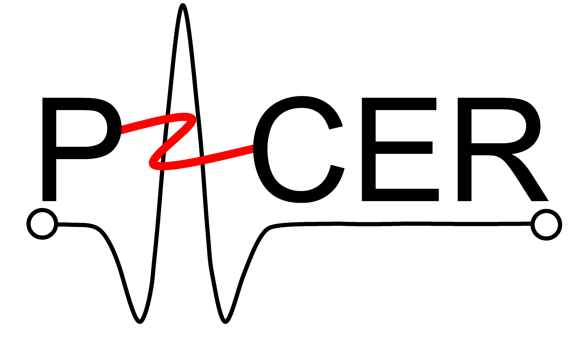

# HeartModelPub

HeartModelPub provides a computational heart model for simulating cardiac electrophysiology and testing implantable pacemaker devices in closed-loop scenarios.

HeartModelPub includes:

- Pacemaker cell models [[1]](https://doi.org/10.1109/tbme.2017.2695537)  
- Cardiomyocytes [[2]](https://doi.org/10.1145/3134845) ,[[3]](https://doi.org/10.1109/tbme.2019.2917212) 
- Cardiac conduction system [[3]](https://doi.org/10.1109/tbme.2019.2917212)
- Electrogram (EGM) signal generation [[4]](https://doi.org/10.1109/embc.2017.8037237)

All models are implemented in MATLAB/Simulink, allowing modular configuration, parameter tuning, and closed-loop simulations.

We have demonstrated in-silico validation of a DDD mode pacemaker using the virtual physiological heart model in the closed loop [[5]](https://doi.org/10.1109/jbhi.2019.2947007)
For C code generation and implementation using Piha, refer to [[6]](https://dl.acm.org/doi/10.5555/2971808.2971959),[[7]](https://dl.acm.org/doi/abs/10.1145/3126536).

Last updated: November 28, 2025.

>© Copyright 2025 Weiwei Ai, wai484@aucklanduni.ac.nz, The University of Auckland 

>   Licensed under the Apache License, Version 2.0 (the "License");you may not use this file except in compliance with the License. You may obtain a copy of the License at http://www.apache.org/licenses/LICENSE-2.0
>
>   Unless required by applicable law or agreed to in writing, software distributed under the License is distributed on an "AS IS" BASIS, WITHOUT WARRANTIES OR CONDITIONS OF ANY KIND, either express or implied.
>   See the License for the specific language governing permissions and limitations under the License.

---

## Table of Contents

1. [Introduction](#introduction)
   - [Theory & Background](#theory--background)
   - [Model Descriptions](#model-descriptions)
   - [Script Models](#script-models)
   - [Data Files](#data-files)
   - [Basics & Key Concepts](#basics--key-concepts)
   - [Code Organization](#code-organization)

2. [Getting Started](#getting-started)
   - [Setup Instructions](#setup-instructions)
   
3. [Cell Models](#cell-models)
   - [Cell Types Overview](#cell-types-overview)
   - [Pacemaker Cells (Type N)](#pacemaker-cells-type-n)
   - [Myocytes (Type M)](#myocytes-type-m)
   - [Subsidiary Pacemakers (Type NM)](#subsidiary-pacemakers-type-nm)

4. [Heart Model](#heart-model)
 
5. [Device Testing & Validation](#device-testing--validation)
   - [Closed-Loop Validation](#closed-loop-validation)
   - [DDD Pacemaker Mode](#ddd-pacemaker-mode)

6. [Examples & Tutorials](#examples--tutorials)
   - [Example 1: Simple Pacemaker Cell](#example-1-simple-pacemaker-cell)
   - [Example 2: Overdrive Suppression](#example-2-overdrive-suppression)
   - [Example 3: Heart Simulation](#example-3-heart-simulation)
   - [Example 4: Closed-Loop Device Testing](#example-4-closed-loop-device-testing)
   - [Example 5: Custom Model Building](#example-5-custom-model-building)

7. [Need-to-Know](#need-to-know)

8. [References](#references)

9. [Acknowledgment](#Acknowledgment)

9. [License History](#License-history)
---

## Introduction

### Theory & Background

### Model Descriptions

### The parameter files  

* Heart_N3.xlsx, the parameters of the heart model with simulation time in msec 
* Heart_N3_second.xlsx, the parameters of the heart model with simulation time in second

### Model Libs      
- Node_N_V6.slx: pacemaker cell model, nodal type, update parameters at the beginning of the slow depolarization, compute t3 and t0 before updating, and compute d2 and d1 after updating;	  
- Node_M_V4.slx, cardiac myocyte model with interface to path model, only update parameters before start new cycle (before enter q1);	  
- Path_V3.slx, path model;  	
- Node_NM_V4.slx, subsidiary pacemaker cell model;	  
- Electrode.slx, Compute the potential sensed by leads due to moving activation on a path;	  
- Sensing.slx, Combine and control all EGM contents;  
- Pre_eventsv1.slx, preprocess input signals;	  
- Ratesv1.slx, compute rates;	  
- Cnds_DDDv1.slx, monitor execution traces and check if the traces meet the specifications;	  
- PMTv1.slx, monitor the occurrence of PMT;  
- PM_DDD_v3.slx, DDD mode pacemaker;	  
- HeartV9.slx, heart model.  

### Notes on the modification of milliseconds (ms) to second 
The model was initially developed using milliseconds (ms) as the simulation time. For hardware integration, we have modified it to use seconds as the simulation time. The modifications include:   
- Node_N_V6/Automaton/function rr= RR(pbcl,psd,pf1,pf2,psigma1sq,psigma2sq,pt)/ line 27, y = ff'*2*pi*pt: removed /1000 in Libs_second.slx
- Sensing/Chart and Sensing/Chart3: use temporalCount(msec) and after(3,msec) in Libs_second.slx; Libs.slx uses temporalCount(sec) and after(3,sec);
- Libs_second/Path_V3/Path, Buffer_i and j, tbi>=599 changed to tbi>=0.599, tbj\>=599 changed to tbj\>=0.599; This only has effects when the APD>600 ms.
-  The clk modules as the inputs to the modules: Sensing, Pre_eventsv1, Ratesv1, Cnds_DDDv1, PMTv1 and PM_DDD_v3 should set Period(secs) =0.001;
- The timing parameters of sensing and pacemaker modules remain the same (using ms).
- Use Heart_N3_second.xlsx, which contains modified parameters for simulation time as second.

### Scripts (src)
- PreBuild.m, a demo showing automatically building a heart model.   	  
- PreCfgfcn.m, Read parameters from the excel file given filenames and data range to;  
   	-	Generate configuration data for heart model building;  
   	-	Create a lookup table for parameters update;  
   	-	Cfgports: input configuration of the demux connecting with the parameter input port;  
   	-	Cfgdata: All the parameters;         	 	 	
- Buildmodel_fcn.m, automatically build a heart model provided that the parameters and the connection relations of cells and paths are available (node names, types and path names); Need to specify the library for the components.	 
- Heart_GUI.m, generate a UI and link to the model.	 
- SaveTrace_sfcn.m, update UI and save simulation traces.	 
- subtightplot.m, make the subplots close to each other, got it on-line.	 
- genpp.m, generate new parameters.
      
## Getting Started  

### Add the library files to the path

To set up, add all the library files to the search path for the current MATLAB® session by running the following in the Matlab command window: 
>> setup_Heart

### Run model simulations  
	
All the running examples are under the directory *models* or *models_refine*, firstly go to the directory by clicking the folder or running the following in the Matlab command window:     
>> cd models	
1. Automaticity simulation of pacemaker cell models  
In the folder, there are three pacemaker cell models: (1) SA node model "SAcell.slx", (2) AV node model "CNcell.slx", and (3) His-Purkinje fibre cell "HPScell.slx".
Pacemaker cells can initiate action potentials without external stimulation. To simulate the models:    		 
    1. Open a cell model, such as "SAcell.slx" , and click "Run" button in Simulink or run the simulation using the Matlab commands:  
	>> open('SAcell.slx')  
	>> sim('SAcell.slx')       		 
    2. Once the simulation finishes, click the scope to view the output trace. 	
2. Overdrive suppression simulation: apply external stimuli to a pacemaker cell and observe the overdrive suppression phenomenon. The model "AV.slx" is connected with a pulse, and the script "simAV_Trace.m" is provided to simulate the model.  
   1. Run the following in the Matlab command window:  
	>> simAV_Trace	   	 
   2. Once the simulation finishes, "Plottrace.m" can be used to plot the simulation traces:       
	>> Plottrace  	
3. Run a heart model without external pacing pulses	  
   1. Open HeartExe.slx and click "Run" in Simulink, or run the following in the Matlab command window:     
	>> open('HeartExe.slx')   
	>> sim('HeartExe.slx')	 	 
   2. Once the simulation finishes, the specified action potentials can be printed out by running the following in the Matlab command window:          
	>> load('Cells.mat')     
	>> plotCells	   
4. Run a heart model with a pacemaker device    
   1. Run the following in the Matlab command window:         
    >> RunCLSfixed     	     
   2. In the GUI, enter the simulation time (ms) in the box under "Stop" within Operations panel on the left.     		 
   3. Click "Start" within Operations panel.      
The electrical activations of the cardiac conduction system is shown on the left (red triangles denote depolarization and blue ones indicate repolarization) and the EGMs are displayed on the right.    		 
   4. Click "Stop" within Operations panel and close the GUI window.         
5. Build a new heart model     
     Refer to PreBuild.m.   

## References
 
**Pacemaker cell models**:  
[1] Ai, Weiwei, et al. "A parametric computational model of the action potential of pacemaker cells." IEEE Transactions on Biomedical Engineering 65.1 (2017): 123-130.  
**Cardiomyocytes**:     
[2] Yip, Eugene, et al. "Towards the emulation of the cardiac conduction system for pacemaker validation." ACM Transactions on Cyber-Physical Systems 2.4 (2018): 32.  
**Cardiac conduction system**:  
[3] Ai, Weiwei, et al. "Cardiac electrical modeling for closed-loop validation of implantable devices." IEEE Transactions on Biomedical Engineering 67.2 (2019): 536-544.  
**EGM generation**:     
[4] Ai, Weiwei, et al. "An intracardiac electrogram model to bridge virtual hearts and implantable cardiac devices." 2017 39th Annual International Conference of the IEEE Engineering in Medicine and Biology Society (EMBC). IEEE, 2017.  
**Closed loop validation**:     
[5] Ai, Weiwei, et al. "Closing the loop: Validation of implantable cardiac devices with computational heart models." IEEE journal of biomedical and health informatics 24.6 (2019): 1579-1588.  
**C code generation and implementation**:   
[6] Allen, Nathan, et al. "Modular code generation for emulating the electrical conduction system of the human heart." Proceedings of the 2016 Conference on Design, Automation & Test in Europe. EDA Consortium, 2016.  
[7] Malik, Avinash, et al. "Modular compilation of hybrid systems for emulation and large scale simulation." ACM Transactions on Embedded Computing Systems (TECS) 16.5s (2017): 118.  
**Other foundational work**:    
[8] Ye, Pei, et al. "Modelling excitable cells using cycle-linear hybrid automata." IET systems biology 2.1 (2008): 24-32.  
[9] Chen, Taolue, et al. "Quantitative verification of implantable cardiac pacemakers over hybrid heart models." Information and Computation 236 (2014): 87-101.  
[10] Jiang, Zhihao, Miroslav Pajic, and Rahul Mangharam. "Cyber–physical modeling of implantable cardiac medical devices." Proceedings of the IEEE 100.1 (2011): 122-137.  
[11] Pajic, Miroslav, et al. "From verification to implementation: A model translation tool and a pacemaker case study." 2012 IEEE 18th Real Time and Embedded Technology and Applications Symposium. IEEE, 2012.   

## Acknowledgment
1. The cardiomyocytes model [2] is based on the work [8] and the initial Simulink implementaion is from the Oxford group [9].
2. The initial topology of the cardiac conduction system [3] is from the work [10].
3. The DDD pacemaker is modified based on a published model [11].

## Need-to-know
* In the path model, only the voltage during q3 contribute to the activation of its neighbouring cells, which is an approximation.
* If the action potential of a cardiomyocyte is greater than the VO during q3 location at given parameters, e.g., out of the physiological range, the output would be saturated to VO. A better saturation approach can be found in the references [5,6], which only saturates the overshoot at the end of q2.
* The models are implemented to facilitate parameterization. The parameters can be updated at run time. For fixed parameters application, the implementation can be simplified. Please refer to the papers [1-4] for the model descriptions.
* The GUI is not fully tested.

## License History

* October 9, 2019  
Version 1 is posted on the public GitHub repository. Copyright 2019 Weiwei Ai, wai484@aucklanduni.ac.nz, The University of Auckland, under license GPL version 
  
* July 29, 2025  
Change the license to Apache-2.0

